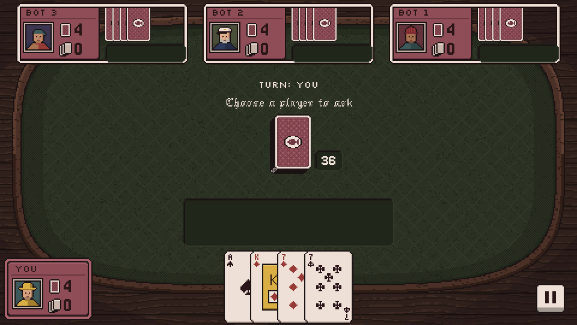
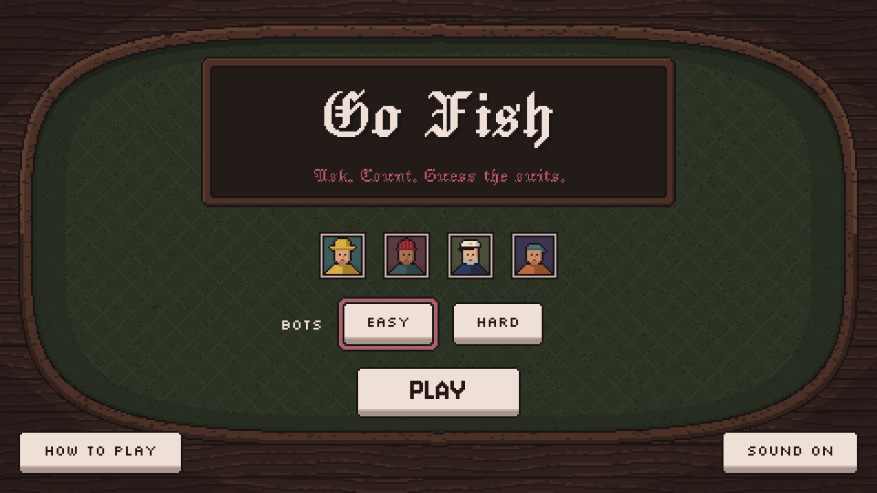
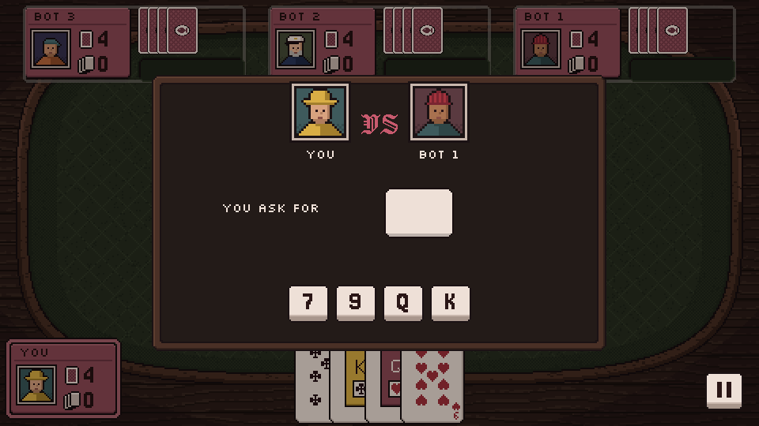
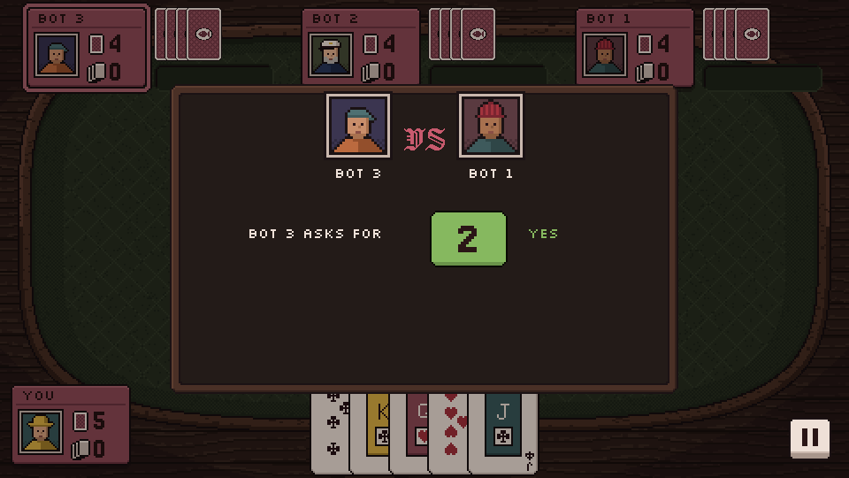
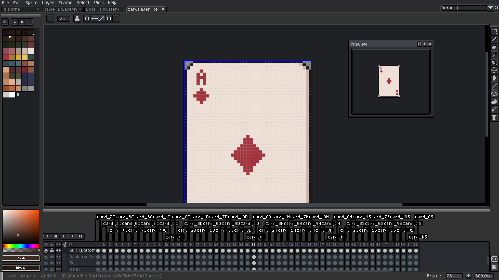
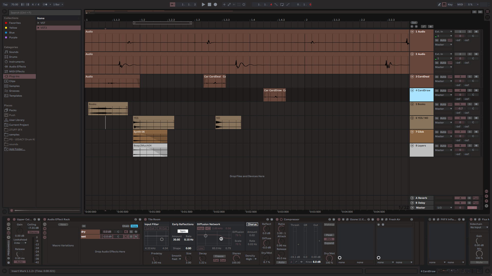
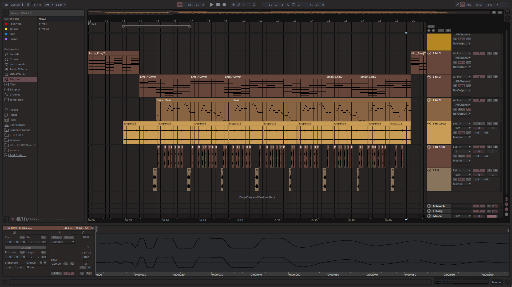

# Go Fish

A twist on Go Fish where asking is only the start: you also have to guess how many cards your opponent holds and exactly which suits they are. One player against three bots, built in Unity for Android (landscape).

## How it plays

1. **Ask** a bot for a rank you already hold. If they have none, you go fish: draw a card and your turn ends.
2. **Count**: if they have it, guess how many cards of that rank they hold. A wrong guess draws a card and ends your turn, and reveals nothing.
3. **Suits**: guess exactly which suits they hold. Suits you hold yourself can't be theirs, so they are left out, and when only one answer is possible it is made for you. Get it right and you take the cards and play again.

Four cards of a rank make a book and are laid automatically. The game ends when all 13 books are down or nobody can catch the leader; most books wins.

Every bot question and answer is shown on the turn board long enough to read, because remembering who asked for what is the real game.

| Your turn | A bot's turn |
| --- | --- |
|  |  |

## Features

- Two bot levels: Easy plays mostly at random; Hard reads the hidden cards and plays almost perfectly, with a small chance of a mistake each step.
- Turn board that stages every move: who asks whom, what they ask for, then the answer. Tap the board to skip ahead during bot turns.
- Your hand is yours to arrange: drag cards to reorder, tap to raise a card, hover to lift it.
- Pause menu, How to play, the Android back button, fades between screens.
- Recorded sound effects and an original looping theme.

## Under the hood

- **Rules engine with no Unity dependency.** `Assets/Scripts/Core` is plain C# in its own assembly (`GoFish.Core`, engine references switched off), covered by 24 EditMode tests in `Assets/Tests/EditMode`.
- **The table watches the game, it never drives it.** The engine appends every ask, guess, draw and transfer to an ordered event list. The turn board, card flights and books each read that list at their own pace, so cards only move after the answer they follow is on screen. The human and the bots use the same three engine calls.
- **No per-frame garbage from the UI update loops**: prompts and board labels are rebuilt only when what they show changes.
- **Pixel-perfect layout**: one art pixel is four UI units on a 1920×1080 canvas, cards are drawn at whole multiples of their 41×61 art, and the table background covers 4:3 to about 21:9.
- **Art sources** are in the repo: layered Aseprite files plus an export script in `ArtSource/`.

## Art and Audio

### Aseprite

### SFX

### Theme

## Running it

1. Open the project with **Unity 6000.0.53f1** (Unity Hub).
2. Press Play. The Editor always starts from the main menu (`Assets/Scenes/MainMenu.unity`); turn this off with **GoFish > Play From Main Menu** to play the match scene directly.
3. Rules tests: **Window > General > Test Runner > EditMode > Run All**.

Controls: mouse or touch. Escape (or Android back) pauses and closes menus.

## Project layout

| Path | What's there |
| --- | --- |
| `Assets/Scripts/Core` | Rules: cards, deck, hands, game state, the engine and its events |
| `Assets/Scripts/Bots` | Bot turns, Easy and Hard |
| `Assets/Scripts/Table` | Opening deal, card flights, books, the table views and seat map |
| `Assets/Scripts/UI` | Turn board, action buttons and prompt, hand layout and dragging, menus, results |
| `Assets/Scripts/Systems` | Match setup, sound effects, music, small shared helpers |
| `Assets/Scripts/Editor` | Editor tools: play from the main menu, fill the card sprite table |
| `Assets/Scenes` | `MainMenu` and `GameTable_cleaning` (the match) |
